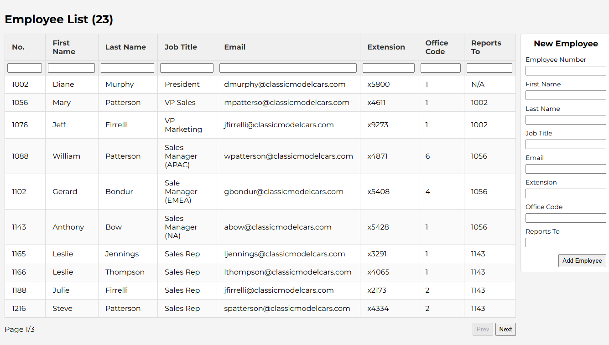

## Employee List

The project represents a simple list of employees and a list of offices, allowing users to manipulate data using a UI provided, which is

- Filtering employees
- Inserting a new employee
- Deleting an existing employee
- Updating an existing employee's information

The goal of this project is to practice using MySQL database in a web application.

## Preview

## Live Project

[Employee List](https://employee-list-production-2c5c.up.railway.app/)
